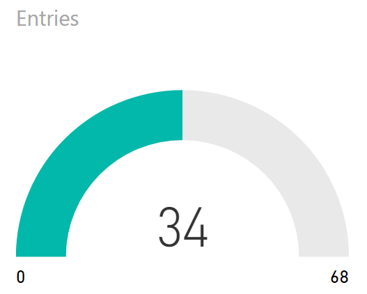

## Eyes on the Prize
### Simple and Effective Dashboard Visualization Techniques

<a href="https://www.catallaxyservices.com">Kevin Feasel</a> (<a href="https://twitter.com/feaselkl">@feaselkl</a>)
<a href="https://csmore.info/on/dashboards">https://CSmore.info/on/dashboards</a>

---

@title[Who Am I?]

@div[left-60]
<table>
	<tr>
		<td></td>
		<td><a href="https://csmore.info">Catallaxy Services</a></td>
	</tr>
	<tr>
		<td></td>
		<td><a href="https://curatedsql.com">Curated SQL</a></td>
	</tr>
	<tr>
		<td></td>
		<td><a href="https://wespeaklinux.com">We Speak Linux</a></td>
	</tr>
</table>
@divend

@div[right-40]
	  
	
	 
	<a href="https://www.twitter.com/feaselkl">@feaselkl</a>

@divend

---

@title[Dashboard Basics]

## Agenda

1. **Dashboard Basics**
2. A "Normal" Dashboard
3. Knowledge
4. Visual Principles
5. Types of Visuals
6. That "Normal" Dashboard Redux

---?image=presentation/assets/background/easel.jpg&size=cover&opacity=20

### What Are Dashboards?

Dashboards tell us about critical business or operational metrics. Key features include: 
* “Single pane of glass”
* Key performance indicators (KPIs) apparent
* Relevant KPIs are bunched together logically
* Layouts are consistent between dashboard elements and between related dashboards

“Dashboards are not an appropriate venue for artistic impression.” -- Stephen Few

---?image=presentation/assets/background/dashboard.jpg&size=cover&opacity=20

### Types of Dashboards

There are three major types of dashboards we will cover today:

* Operational Dashboards
* Strategic Dashboards
* Tactical Dashboards

These different dashboards fit the differing needs of an organization.

---?image=presentation/assets/background/lab.jpg&size=cover&opacity=20

### Operational Dashboards

Operational dashboards provide “day-to-day” data that assist line employees in making decisions.  They tend to be specific to the nature of the user.

---?image=presentation/assets/background/rollercoaster.jpg&size=cover&opacity=20

### Operational Dashboards

Operational dashboards **drive action** by informing that a process may be “out of control” and helping operators find the cause.

---

### Strategic Dashboards

Strategic dashboards focus on KPIs tracked periodically and displayed at an aggregated level.

---

### Tactical Dashboards

Tactical dashboards show strategic data at an almost-operational level.

---

@title[A "Normal" Dashboard]

## Agenda

1. Dashboard Basics
2. **A "Normal" Dashboard**
3. Knowledge
4. Visual Principles
5. Types of Visuals
6. That "Normal" Dashboard Redux

---

### A "Normal" Dashboard

---?image=presentation/assets/background/hardware.jpg&size=cover&opacity=20

### A "Normal" Dashboard

We can intuitively see that this is not a good dashboard, but we might not be able to explain all the reasons why.  The rest of this session will give us the tools we need to understand why this is not a good dashboard.

---

@title[Knowledge]

## Agenda

@div[left-50]
1. Dashboard Basics 
2. A "Normal" Dashboard 
3. **Knowledge** 
4. Visual Principles 
5. Types of Visuals 
6. "Normal" Redux
@divend

@div[right-50]

@divend

---

### The Key:  An Emotional Response

A great dashboard evokes one of two emotions from your intended audience:  happiness or anger.

If a dashboard evokes neither emotion in your intended audience, it isn't working.

---?image=presentation/assets/background/audience.jpg&size=cover&opacity=20

### Know Your Audience

Key factors in knowing your audience:

* Who is your intended audience?
* How will they use your dashboard?
* What actions do you want them to take as a result?
* Are you showing the right measures in the right way?
* What cultural differences might matter?

---?image=presentation/assets/background/employees.jpg&size=cover&opacity=20

### Who Is Your Intended Audience?

* Technical specialists or line operators?
* Lower or mid-level management
* Upper-level management?
* C-levels?
* The board?
* External regulators or auditors?
* The general public?

For each of these, we display different measures in different ways.

---

### Intended Audience

This dashboard is great for a line worker, but a board member likely won't care about operational metrics.

---?image=presentation/assets/background/businessdecision.jpg&size=cover&opacity=20

### Intended Use

How will users make use of your dashboard?  What actions do you want them to take as a result?

Your job as a dashboard creator is to provide relevant metrics in an easy-to-understand way, requiring the user to get relevant information as easily as possible in order to make good business decisions.

---?image=presentation/assets/background/devices.jpg&size=cover&opacity=20

### Intended Use

Critical considerations:

* Do users need to see historical data or just the present value?
* Is there a baseline or known good value?
* Under what circumstances should a user act?  Can you display those rules?
* What media will your audience use to view the data?  Examples:  phone, tablet, desktop, TV.

---?image=presentation/assets/background/sales.jpg&size=cover&opacity=20

### Right Measures, Right Way

Are you showing the right measures in the right way? For a sales team dashboard, you want to include sales-centric measures like leads in different steps of the pipeline, likelihood of a contact making a purchase, and number of sales by person against a quota.  You don't want to include measures like server uptime, net margin, or number of high-severity issues.

---

### Right Measures, Right Way

---?image=presentation/assets/background/chinese-temple.jpg&size=cover&opacity=20

### Cultural Differences

What cultural differences might matter?

The meanings of colors can differ between cultures.  For example, in European and American culture, red typically has one of two major meanings:  love and danger.  In finance, we use red to indicate negative values (going back to danger).

By contrast, in China, red has historically indicated prosperity--people give gifts of money at weddings and during major holidays in small red envelopes.

---

@title[Visual Principles]

## Agenda

1. Dashboard Basics
2. A "Normal" Dashboard
3. Knowledge
4. **Visual Principles**
5. That "Normal" Dashboard Redux

---?image=presentation/assets/background/eye.jpg&size=cover&opacity=20

### Visual Principles

In this section, we will look at six important visual principles:

* Cognitive Load
* Less Is More
* Where The Eye Looks
* The Rule Of Thirds
* Glanceability
* Color Vision Deficiency

---?image=presentation/assets/background/graywall.jpg&size=cover&opacity=60

### Cognitive Load

Our working memory can hold approximately 3-7 items at one time.  Think of this working memory like registers and our long-term memory like RAM:  we move information out of long-term memory into working memory and (sometimes) vice versa.

---?image=presentation/assets/background/ram.jpg&size=cover&opacity=20

### Cognitive Load

Because of this, we want to look for ways to reduce mental load.  Techniques include:

* Allow people to group things together using attributes like size, shape, orientation, thickness, and color.
* Remove "noise" from the reader--get rid of things that distract or cause unnecessary load.
* Have your visuals tell a coherent story.

---

### Less Is More

Remove unnecessary clutter.

---

### Less Is More

After removing the clutter, notice how much easier this is to read.

---

### Less Is More

Next, remove legends whenever possible.  Legends require people to look up and down over and over to make sense of your visual.  If you have a detailed legend, you are probably using the wrong visual.

---

### Less Is More

Reduce your color usage.  Keep color usage limited and consistent and ensure colors add value.

---

### Less Is More

In this case, it's clear that the colors were not in fact helping anything.

---

### Less Is More

I can now highlight a particular value with color, a **pre-attentive attribute**.

---

### Less Is More

Color is also an associative property, meaning people tend to link similar things with the same color together.  If you break that pattern, you can confuse people.

@div[left-50]

@divend

@div[right-50]

@divend

---

### 3D Pains

Humans have trouble with precise 3D measurements.  In rare cases, a 3D image is better than a 2D equivalent, but that is never the case for bar or column charts.  3D "gloss" is also not helpful for getting your point across.

---

### Where We Look

In European languages, we read left-to-right, top-to-bottom.

---

### Where We Look

In Middle Eastern languages (Hebrew and Arabic), we read right-to-left, top-to-bottom.

---

### Where We Look

In ancient Asian languages (especially Chinese), we read top-to-bottom, right-to-left.

---

### Where We Look

@div[left-50]

In modern Chinese, we read left-to-right, top-to-bottom.

In modern Japanese, we read left-to-right, top-to-bottom (except when we don't).

@divend

@div[right-50]

@divend

---

### The Gutenberg layout:

---

### The Z layout:

---

### The F layout:

---?image=presentation/assets/background/focalpoints.jpg&size=cover&opacity=20

### Where We Look

These layouts tend to work for evenly distributed, homogeneous data, things like newspaper articles which are text-heavy in content. For image-heavy dashboards, people follow a different principle:  **focal points**.

---?image=presentation/assets/background/focalpoints.jpg&size=cover&opacity=100

---

### Focal Points

---

### The Rule of Thirds

The Rule of Thirds applies to images, but also to dashboards.

---

### The Rule of Thirds

The strategic dashboard (sort of) follows the Rule of Thirds.

---?image=presentation/assets/background/border-collie.jpg&size=cover&opacity=20

### Glanceability

Glanceability is the idea that a human can, at a glance, gain important information from your dashboard.  Things which help glanceability include:

* Clear purpose in metric design and display
* No scrolling
* Group metrics by function into sections:  don't make users search around for related data
* Easy to see (and differentiate) sections
* Consistent layouts and decisions
* Easy to read:  large font, rounded numbers

---?image=presentation/assets/background/grayscale-lighthouse.jpg&size=cover&opacity=20

### Color Vision Deficiency

CVD affects 8% of men and 0.5% of women.

|Name|Cones|Likelihood|
|----|-----|----------|
|Protanomaly|Red|1% M|
|Protanopia|Red|1% M|
|Deuteranomaly|Green|5% M|
|Deuteranopia|Green|1% M|
|Tritanomaly|Blue|Rare M/F|
|Tritanopia|Blue|Rare M/F|

---

### Color Vision Deficiency

The Badlands, as seen by drone:

---

### Color Vision Deficiency

The Badlands, with protanopia:

---

### Color Vision Deficiency

The Badlands, with deuteranopia:

---

### Color Vision Deficiency

The Badlands, with tritanopia:

---

### Color Vision Deficiency

Remember the old SSIS?

---

### Color Vision Deficiency

SSIS 2008 with tritanopia:

---

### Color Vision Deficiency

SSIS 2008 with protanopia:

---

### Color Vision Deficiency

SSIS 2008 with deuteranopia:

---?image=presentation/assets/background/sepia-city.jpg&size=cover&opacity=20

### Color Vision Deficiency

Possible solutions:

* Use color-safe palettes
* Use grayscale for images (also helps if they're going to be printed out)
* Use colors sparingly and consistently
* Use patterns instead of (or in addition to) colors to highlight a particular element
* Use a website like <a href="http://www.color-blindness.com/coblis-color-blindness-simulator/">Coblis</a> to simulate various forms of CVD

---

@title[Types of Visuals]

## Agenda

1. Dashboard Basics
2. A "Normal" Dashboard
3. Knowledge
4. Visual Principles
5. **Types of Visuals**
6. That "Normal" Dashboard Redux

---

### Types Of Visuals

---

### Table / Matrix

Great when users need to compare data directly.  Tables and matrices generally don't belong on strategic dashboards, but do belong in tactical dashboards and sometimes operational dashboards.

---

### Column Chart

Great when there are few categories but potentially many periods.

---

### Bar Chart

Great when there are few periods with many categories.  Also good when labels are lengthy.

---?image=presentation/assets/background/bison-fighting.jpg&size=cover&opacity=20

### Bar Versus Column Chart

Choose a bar chart if:
* Category names are long-term
* You have a **lot** of categories
* You have relatively few periods (ideally, 1)

Choose a column chart if:
* Viewing across periods is important
* You have many periods with relatively few categories
* Category names are short

---

### Bar And Column Charts

Bar and column charts should start at the origin (0).

---

### Cleveland Dot Plots

Named after Bill Cleveland, this is a minimalistic visual for comparing categories.

Dot plots are not native to Power BI, but there are a couple of custom visuals which give you dot plots.  They can provide a lot of information in a very small amount of space, making them great accompaniments for tables or larger visuals.

---

### Radar Charts

Okay for showing a normalized comparison of measures across several categories.

---?image=presentation/assets/background/football.jpg&size=cover&opacity=20

### Radar Charts

My fondness of radar charts comes from playing Madden NFL in franchise mode.

---

### Line Charts

Great for time series data stretching over many periods with non-cyclical data, but showing few categories.  You can also use a column chart here, especially with only 2-3 categories

---

### Line and Column Charts

Risky chart, but works well with two inter-related but distinct variables. Often used with stock market levels and volumes.

---?image=presentation/assets/background/books-45degree.jpg&size=cover&opacity=20

### Line Charts:  From The Origin?

For bar charts, we want to start at the origin.  For line charts (and dot plots), we don't need to.  Instead, Cleveland, McGill, & McGill proposed making the average line slope 45 degrees.  This principle reduces the potential for confusion when viewing a line chart and is why it's fine to have the bottom of a line chart start above 0.

Power BI and Excel (as well as many data visualization tools) automatically do this for you.

---

### Scatterplots

Great for showing relationships between two variables over a relatively small number of categories.

---

### Bubble Charts

Great for showing relationships between three variables, but as bubbles get larger, the image becomes harder to follow.

---

### Treemaps

Risky chart, but great for showing the relative share of value for a medium to large number of hierarchical, categorical values.

---

### Charts I Don't Like

The following charts are ones which have their uses, but I'm not particularly fond of them.

We will look at potentially good use cases, but also look at why I don't much like these charts.

---

### Pie Charts

Best use:  simple share of a static total.

---

### Why We Hate Pie Charts

* Angle differences are hard to discern.
* Small percentages are hard to differentiate.
* Pie charts usually require legends.

---

### Pie Chart Alternatives

* Treemaps for comparing many categories.
* Column charts for comparing few categories.
* Simple numbers (e.g., 58% - 42%)

---

### Gauges

Best use:  showing progress toward a target or as a percent full.

---

### The Problem With Gauges

Gauges are okay, but they need to show progress toward a goal or provide an intuitive status.

---

### Stacked Area Charts

Best use:  showing relative and absolute differences of data which changes over time but has relatively few periods.

---

### The Problem With SACs

Looking at this again, what information can we know for sure?  Just the top line and the bottom category.

---

### SAC Alternatives

Instead, you can show information more clearly with a line chart.  The downside is that you'll have to calculate the total yourself if you want it to show.

---

### SAC Alternatives

Ribbon charts show rank changes but tend to be noisy and only useful when users can mouse over the data points.

---

@title[That "Normal" Dashboard Redux]

## Agenda

1. Dashboard Basics
2. A "Normal" Dashboard
3. Knowledge
4. Visual Principles
5. Types of Visuals
6. **That "Normal" Dashboard Redux**

---

### "Normal" Redux

---

### Pie Charts

---

### Too Many Colors

---

### Unnecessary 3D

---

### Category Overload

---

### Scroll Bars

---

### Color Reuse

---

### Unnecessary Chrome

---

@title[Wrapping Up]

### Wrapping Up

Keep these tips in mind when creating a dashboard:

* Use appropriate visuals
* Use color consistently and as a signal
* Avoid chartjunk and unnecessary chrome
* Avoid legends when possible
* Avoid scroll bars
* Make your dashboard glanceable
* Make appropriate use of whitespace
* Ensure your dashboard is CVD-friendly

---

### Wrapping Up

To learn more, go here:  <a href="https://csmore.info/on/dashboards">https://CSmore.info/on/dashboards</a>

And for help, contact me:  <a href="mailto:feasel@catallaxyservices.com">feasel@catallaxyservices.com</a> | <a href="https://www.twitter.com/feaselkl">@feaselkl</a>
